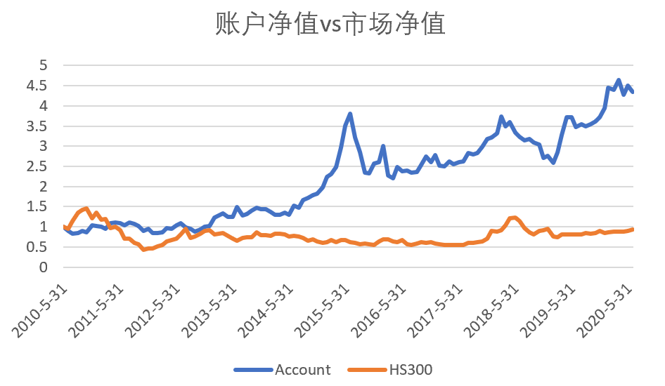

# 基于RMW盈利因子的市场中性策略
####作者：逸昕
本项目采用基于RMW盈利因子的A股选股策略，使用沪深300股指期货对股票仓位的市场风险进行β对冲，每月再平衡，组合为单因子市场中性策略。
在参数回归上，项目原采用基于TensorFlow的机器学习算法，通过反馈神经网络完成因子β与投资组合β的拟合，由于回测阶段运算量巨大、耗时较长，改采用OLS算法进行回归，但仍保留原机器学习方法接口供调试用。
##回测概况
    策略名称：基于RMW盈利因子的市场中性策略
    开始日期：2010年4月30日
    结束日期：2020年6月30日
    回测周期：122个月
    频率限制：最小持仓周期为365个自然日
    股票池：沪深300成分股(2005年1月至2020年6月始终为成分股的120只个股)
    股指期货：IF（每月再平衡）
    最大持仓：10
    初始资本：1000万
    持有期收益：335.28%
    年化收益：33.25%
    夏普比率：0.67
    最大回撤：0.42
  
注1：由于本人没有万德账号，无法获取沪深300成分股动态数据，在数据选取方面，本项目使用2020年6月30日沪深300成分股作为标的，剔除其中在2005年1月时
未被纳入成分股的个股，剩余股票池共有120只股票。  
注2：沪深300股指期货可追溯历史数据始于2010年4月，故策略回测起始期同为2010年4月。
##因子构建
本人借鉴Fama French五因子模型的思想，构筑了RMW盈利因子。令2007年4月30日至2020年6月30日间始终为沪深300成分股的个股作为股票池标的，共120只。
获取股票池标的所对应的每股价格、市值、ROE的月度数据，其中对ROE（季度）数据采取线性插值的方法进行缺失值填充。  
在每一时间截面上，将120只股票依照起ROE大小，由小到大进行排序，选取排名前1/3的40只股票作为Weak组，排名后1/3的股票作为Robust组，
对每组股票当月收益进行市值加权求平均处理作为组内收益期望值，RMW因子即为Robust组期望收益与Weak组期望收益之差。  
##选股策略
在每一时间截面t上，获取标的池中个股历史三年的收益率数据与同期RMW因子数据，将每只个股的三年月度收益率与同期RMW因子数据组合构成(36, 2)矩阵，共120个，
对每只个股进行形为 R ~ β · RMW 的回归分析，得到每只个股在RMW上的暴露值β。项目最初使用TensorFlow搭建反馈神经网络进行参数训练，采取梯度下降、学习率衰减算法，
引入EMA影子变量提高模型泛化性，考虑到需要训练神经网络共有120 * 122 = 14640个，即使每张网络训练次数使用empirical analysis得出的最小较优次数80，
仍需训练逾越117万轮，在不进行项目优化的的前提下时间成本较高，故弃用机器学习算法而选用传统OLS方法进行参数拟合，同时保留机器学习算法接口供测试优化之用。  
在截面t上，已求得每只个股RMW因子暴露值β，根据 α = Rt - β · RMW 计算个股α，并对截面t上全部个股α进行排序，假设最大持仓个股数为n，
选取α前n小且α < 0的的个股作为截面t上选出的个股。投资时，将全部资金中用于股票投资的部分分成n份，均匀投资于每只所选股票。
##对冲策略
本策略使用β对冲作为对冲策略，在每个月度交易日上，若在持股票全部无法交易，我们对期货持仓进行调整。首先获取股票持仓组合中每只个股历史3年的月度收益率，
对组合中个股的每个时间截面上的月度收益依照时间t的仓位进行持仓市值加权求平均处理，得到组合历史收益矩阵Rp，形为（36，1）。
获取t时刻沪深300指数3年内的月度收益率矩阵Ri，形为（36，1），根据 Rp ~ β · Ri 计算在持股票投资组合的市场风险暴露β，考虑到期货交易存在杠杆L，
我们算得用于做空沪深300股指期货的资金比例为 β· L / (β · L + 1)，根据该比例调整仓位。  
在每个存在可交易在持股票的交易日，首先根据等市值对冲法计算初始股票资金比例，为 1 / (L + 1)，通过“选股策略”中的方法进行选股，
对在持、无法交易但在选股名单中的股票不做增减仓处理。完成股票投资后，根据上一段提到的比例计算方法求得应做空股指期货的资金比例并计算对应资金规模，
与进行股票投资后账户剩余现金做比较，取较小值进行期货做空。
##程序设计
项目运行环境如下:

    系统环境：Windows 10
    Python版本：3.5.6
    IDE：PyCharm 2020.2
    TensorFlow版本：1.10.0

项目结构上，我们应用了面向对象编程思维，建立了Stock和Future两个类分别进行股票和期货的仓位管理，同时建立Account类管理投资账户。
此外，项目有Factor和Strategy两个接口，分别负责存放计算因子值的方法，与存放选股策略、对冲策略、参数回归等的方法。    
###Stock类
Stock类方面，每个Stock对象有购买日期、购买价格、当前日期、当前价格、持有手数、能否平仓共六个实例域，同时有四个实例方法，
分别为更新账户信息（当前日期，当前每股价格，能否平仓）、平仓（将个股持仓总市值转入账户余额）、获取股票名称、获取个股持仓市值：  
```
class Stock:  
    def __init__(...):
    self.purchase_date = ...
    self.purchase_price = ...
    self.current_date = ...
    self.current_price = ...
    self.lot = ...
    self.can_sell = ...
     
    def update_stock_info(...)
    
    def close_stock_position(...)

    def get_name(...)

    def get_stock_value(...)
```
###Future类
Future类方面，每个Future对象有购买价格、持有手数、当前价格三个实例域，同时与Stock类相似，有两个实例方法，
分别负责更新期货信息（更新当前价格）和平仓。
```
class Future:
    def __init__(...):
        self.purchase_price = ...
        self.lot = ...
        self.current_price = ...
    
    def update_future_info(...)

    def close_future_position(...)
```
###Factor接口
Factor接口负责存放因子计算方法，在该项目中仅存放了RMW因子的计算方法。
```
def RMW(...): ...
```
###Strategy接口
Strategy接口存放机器学习所需的超参数，注意若改用机器学习方法进行参数拟合，务必将处理器个数 CPU_NUMBER 参数根据运行环境进行调整，
否则可能对计算机硬件造成伤害。此外，Strategy接口共有9个方法，可分为收益计算、选股策略、对冲策略、参数回归四大类：
```
# Hyper-Parameter Settings
STEP = 100
...

def get_return_data(...): # 将价格序列转为收益率序列

def get_rmw_factor_list(...) # 获取RMW因子时间序列

def get_selected_stock(...) # 依照上述选股方法进行选股并获取所选股票列表

def __get_alpha(...) # 私有方法，获取特定时间截面的全市场alpha值

def __get_beta_ols(...) # 私有方法，通过OLS算法计算因子暴露

def __get_beta_machine_learning(...) # 私有方法，构建前馈神经网络Graph，通过机器学习算法计算因子暴露

def __backward(...) # 私有方法，__get_beta_machine_learning()的helper function，构建反馈神经网络结构并进行模型训练，返回因子暴露

def get_stock_weight(...) # 获取根据等市值对冲方法计算的股票投资比例

def get_future_weight(...) # 获取根据beta对冲方法计算的期货做空比例
```